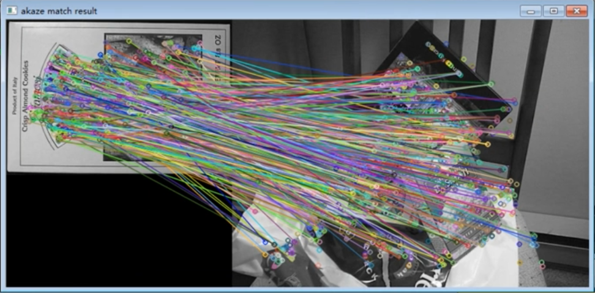
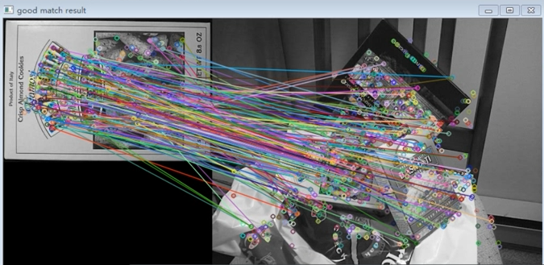
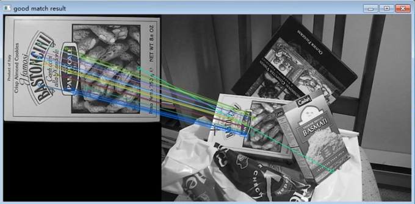

# AKAZE局部匹配

## 1 简介

- AOS构造尺度空间
- Hessian矩阵特征点检测(找到关键点)
- 方向指定基于一阶微分图像(有了方向,就有了旋转不变性,没有方向就没有什么旋转不变性这些特性)
- 描述子生成

这个算法比较难.

## 2 与SIFT,SUFR比较

- 更加稳定
- 非线性尺度空间
- AKAZE速度更加块
- 比较新的算法,只有Opencv新版本才可以用

## 3 代码演示

### 3.1 KAZE与AKAZE检测

通过检测对比KAZE与AKAZE两个算法的速度.


### 3.2 KAZE与AKAZE匹配

所谓匹配,其实就是DDM的最后一步.首先通过detector获得keyPoint,然后通过Compute得到描述子,这样两个DD我们就得到了,然后M再作一个匹配.匹配的话我们可以用BF,也可以用FLANN.如过再进一步的话,就可以把匹配到的图的区域给画出来.

匹配代码:

```
#include <opencv2/opencv.hpp>
#include <iostream>
#include <math.h>

using namespace cv;
using namespace std;

int main(int argc, char** argv) {
        Mat img1 = imread("D:/vcprojects/images/box.png", IMREAD_GRAYSCALE);
        Mat img2 = imread("D:/vcprojects/images/box_in_scene.png", IMREAD_GRAYSCALE);
        if (img1.empty() || img2.empty()) {
                printf("could not load images...\n");
                return -1;
        }
        imshow("box image", img1);
        imshow("scene image", img2);


        // extract akaze features
        Ptr<AKAZE> detector = AKAZE::create();
        vector<KeyPoint> keypoints_obj;
        vector<KeyPoint> keypoints_scene;
        Mat descriptor_obj, descriptor_scene;
        double t1 = getTickCount();
        detector->detectAndCompute(img1, Mat(), keypoints_obj, descriptor_obj);
        detector->detectAndCompute(img2, Mat(), keypoints_scene, descriptor_scene);
        double t2 = getTickCount();
        double tkaze = 1000 * (t2 - t1) / getTickFrequency();
        printf("AKAZE Time consume(ms) : %f\n", tkaze);

        // matching
        FlannBasedMatcher matcher(new flann::LshIndexParams(20, 10, 2));
        //FlannBasedMatcher matcher;
        vector<DMatch> matches;
        matcher.match(descriptor_obj, descriptor_scene, matches);

        // draw matches(key points)
        Mat akazeMatchesImg;
        drawMatches(img1, keypoints_obj, img2, keypoints_scene, matches, akazeMatchesImg);
        imshow("akaze match result", akazeMatchesImg);
        /*
        vector<DMatch> goodMatches;
        double minDist = 100000, maxDist = 0;
        for (int i = 0; i < descriptor_obj.rows; i++) {
                double dist = matches[i].distance;
                if (dist < minDist) {
                        minDist = dist;
                }
                if (dist > maxDist) {
                        maxDist = dist;
                }
        }
        printf("min distance : %f", minDist);
        for (int i = 0; i < descriptor_obj.rows; i++) {
                double dist = matches[i].distance;
                if (dist < max( 1.5*minDist, 0.02)) {
                        goodMatches.push_back(matches[i]);
                }
        }

        drawMatches(img1, keypoints_obj, img2, keypoints_scene, goodMatches, akazeMatchesImg, Scalar::all(-1), 
                Scalar::all(-1), vector<char>(), DrawMatchesFlags::NOT_DRAW_SINGLE_POINTS);
        imshow("good match result", akazeMatchesImg);
        */
        waitKey(0);
        return 0;
}
                         
```

结果:这个结果是matches之后的结果.这个是超级多的,暴力匹配的matches.



 经过处理后,得到更好的matches.如图所示:



通过调整阈值,就是他们的距离到到时才留着,并且把不匹配的关键点不让他们显示,得到的结果如图所示,这样显示的效果就更加好了.



前面的第一个结果是暴力匹配得到的结果,后面两个是经过调整他们匹配点之间的阈值来决定该留住哪些点.

- 如何要进一步的处理,这时候就把匹配的区域给画出,这样就更加的完美了.