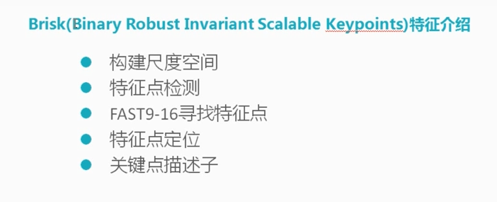
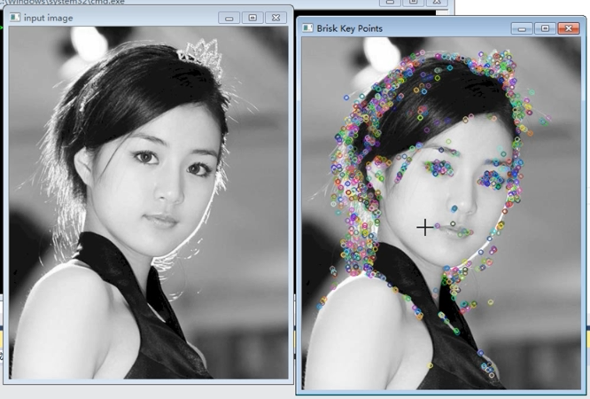
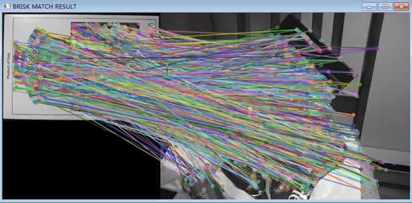

# Brisk特征检测

# 重点

- **对于算法,得到旋转不变性,尺度不变性,这些不变性都有了,我们使用这个算法才更有用.对于图像要想变成我们能运用的特征,必须要有这个特点:****
  - **第一:旋转不变性**
  - **第二:尺度空间不变性**
  - **第三:光照强度,最好能抗干扰.**

 **如果我们要发明一种特征,并且这些特征是能用的,要作用这三个尺度取衡量.我们做出来的特征符合不符合,如果不符合,我们要想办法让他符合.如果符合这几个特点,那么这个特征就可以使用.**

- **有了这些以后,然后再找快速匹配和快速计算的方法**


## 1 简介

与前面的SIFT,SURF有相似点的.前面几步差不多,但是后面提取特征描述子那里有点不一样,找旋转不变性的时候不一致.但是在找关键点之前他也要构建尺度空间,他也要构建金字塔.构建金字塔也不一样.



尺度空间可以通过高斯金字塔表现出来.特征点查找就是keypoints,特征点定位和SIFT中的泰勒展开及其的相似.

- 关键点描述子


得到描述子之后,就可以进行匹配了.

## 2 代码演示

```
#include <opencv2/opencv.hpp>
#include <iostream>

using namespace cv;
using namespace std;

int main(int argc, char** argv) {
        Mat img1 = imread("D:/vcprojects/images/box.png", IMREAD_GRAYSCALE);
        Mat img2 = imread("D:/vcprojects/images/box_in_scene.png", IMREAD_GRAYSCALE);
        if (img1.empty() || img2.empty()) {
                printf("could not load images...\n");
                return -1;
        }
        imshow("box image", img1);
        imshow("scene image", img2);

        // extract BRISK features
        Ptr<Feature2D> detector = BRISK::create();
        vector<KeyPoint> keypoints_obj;
        vector<KeyPoint> keypoints_scene;
        Mat descriptor_obj, descriptor_scene;
        detector->detectAndCompute(img1, Mat(), keypoints_obj, descriptor_obj);
        detector->detectAndCompute(img2, Mat(), keypoints_scene, descriptor_scene);

        // matching
        BFMatcher matcher(NORM_L2);
        vector<DMatch> matches;
        matcher.match(descriptor_obj, descriptor_scene, matches);

        // draw matches
        Mat matchesImg;
        drawMatches(img1, keypoints_obj, img2, keypoints_scene, matches, matchesImg);
        imshow("BRISK MATCH RESULT", matchesImg);

        //  draw key points
        // Mat resultImg;
        // drawKeypoints(src, keypoints, resultImg, Scalar::all(-1), DrawMatchesFlags::DEFAULT);
        // imshow("Brisk Key Points", resultImg);

        waitKey(0);
        return 0;
}

```

- 结果



通过以上可以看出,这是一个很好的一个keypoints提取.这里在DDM中的第一个D.

有了这个以后,我们就可以进一步找出描述子,第二个D,还有最后一个M\.得到的结果如下:(提取BRISK特征和进行匹配).这里使用BF进行暴力匹配.



 


